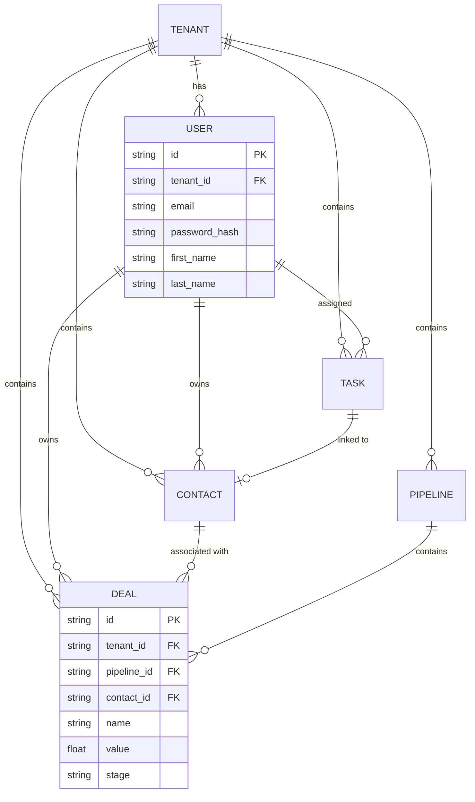
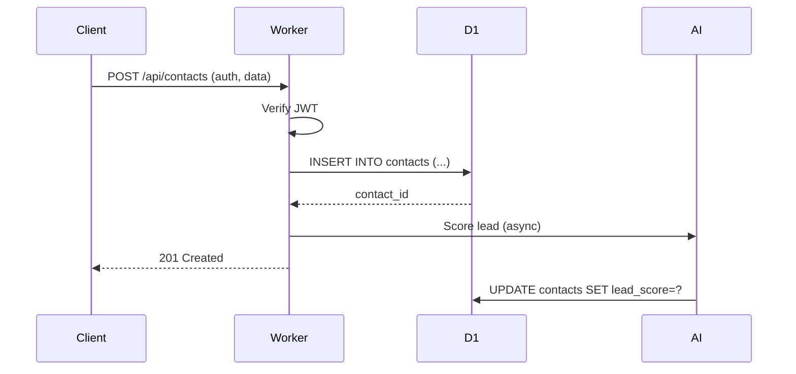

# EdgeForce CRM — System Architecture Document

**Built by RJ Business Solutions**
📍 1342 NM 333, Tijeras, New Mexico 87059

---

## Table of Contents

1. [System Overview](#system-overview)
2. [Architecture Diagram](#architecture-diagram)
3. [Component Architecture](#component-architecture)
4. [Data Flow](#data-flow)
5. [Technology Stack](#technology-stack)
6. [Architecture Decision Records (ADRs)](#adrs)

---

## 1. System Overview

### High-Level Architecture

```
┌─────────────────────────────────────────────────────────────────┐
│                        CLIENT LAYER                             │
│  ┌──────────────┐  ┌──────────────┐  ┌──────────────┐          │
│  │   Web App    │  │  Mobile PWA  │  │   API CLI    │          │
│  │  Next.js 16  │  │  React Native │  │  wrangler   │          │
│  └──────┬───────┘  └──────┬───────┘  └──────┬───────┘          │
└─────────┼─────────────────┼─────────────────┼──────────────────┘
          │                 │                 │
          ▼                 ▼                 ▼
┌─────────────────────────────────────────────────────────────────┐
│                        EDGE LAYER                               │
│  ┌────────────────────────────────────────────────────────────┐ │
│  │              Cloudflare Global Network (300+ PoPs)          │ │
│  └────────────────────────────────────────────────────────────┘ │
│  ┌──────────────┐  ┌──────────────┐  ┌──────────────┐         │
│  │  Pages (CDN) │  │   Workers    │  │ Durable Objs  │         │
│  │  Next.js 16  │  │   Hono API   │  │ Real-time    │         │
│  └──────────────┘  └──────────────┘  └──────────────┘         │
└─────────────────────────────────────────────────────────────────┘
          │                 │                 │
          ▼                 ▼                 ▼
┌─────────────────────────────────────────────────────────────────┐
│                        STORAGE LAYER                            │
│  ┌──────────────┐  ┌──────────────┐  ┌──────────────┐         │
│  │   Cloudflare │  │    Cloudflare │  │   Cloudflare  │        │
│  │      D1      │  │      KV       │  │      R2       │        │
│  │   (SQLite)   │  │  (Sessions)   │  │   (Storage)   │        │
│  └──────────────┘  └──────────────┘  └──────────────┘         │
│                                                                 │
│  ┌─────────────────────────────────────────────────────────────┐│
│  │                    Workers AI (inference)                   ││
│  │              Lead Scoring, Text Analysis, NLP              ││
│  └─────────────────────────────────────────────────────────────┘│
└─────────────────────────────────────────────────────────────────┘
```

### Deployment Architecture

```
                    Cloudflare Network
                    ═════════════════
                         │
    ┌────────────────────┼────────────────────┐
    │                    │                    │
    ▼                    ▼                    ▼
┌────────┐          ┌────────┐          ┌────────┐
│   ORD  │          │   ORD  │          │   ORD  │
│ (Dallas)│         │ (NYC)  │          │ (LA)  │
└────────┘          └────────┘          └────────┘
    │                    │                    │
    └────────────────────┼────────────────────┘
                         │
                    ┌────┴────┐
                    │  Workers  │
                    │  (Global) │
                    └────┬────┘
                         │
        ┌────────────────┼────────────────┐
        │                │                │
        ▼                ▼                ▼
    ┌────────┐      ┌────────┐      ┌────────┐
    │   D1   │      │   KV   │      │   R2   │
    │(Global)│      │(Global)│      │(Global)│
    └────────┘      └────────┘      └────────┘
```

---

## 2. Architecture Diagram

### Component Interaction Diagram

```
┌─────────────────────────────────────────────────────────────────┐
│                        FRONTEND (Next.js 16)                     │
├─────────────────────────────────────────────────────────────────┤
│  ┌──────────┐  ┌──────────┐  ┌──────────┐  ┌──────────┐     │
│  │ TanStack │  │   Zustand │  │ React    │  │  Motion   │     │
│  │  Query   │  │   Store   │  │  Hook    │  │    12     │     │
│  └────┬─────┘  └────┬─────┘  └────┬─────┘  └────┬─────┘     │
│       │             │             │             │             │
│       └─────────────┴─────────────┴─────────────┘             │
│                           │                                    │
│                    ┌──────┴──────┐                             │
│                    │   lib/api   │                             │
│                    │  (ApiClient)│                             │
│                    └──────┬──────┘                             │
└───────────────────────────┼────────────────────────────────────┘
                            │
                            ▼
┌─────────────────────────────────────────────────────────────────┐
│                     BACKEND (Cloudflare Worker)                 │
├─────────────────────────────────────────────────────────────────┤
│  ┌────────────────────────────────────────────────────────────┐│
│  │                       Hono 4.12.8                           ││
│  │  ┌─────────┐  ┌─────────┐  ┌─────────┐  ┌─────────┐     ││
│  │  │  Auth   │  │Contacts │  │ Deals   │  │ Tasks   │     ││
│  │  │ Router  │  │ Router  │  │ Router  │  │ Router  │     ││
│  │  └─────────┘  └─────────┘  └─────────┘  └─────────┘     ││
│  └────────────────────────────────────────────────────────────┘│
│                           │                                    │
│  ┌─────────┐  ┌─────────┐  │  ┌─────────┐  ┌─────────┐       │
│  │  Rate   │  │   CORS  │  │  │  Valid  │  │   AI    │       │
│  │ Limit   │  │ Middle  │  │  │   Zod   │  │ Gateway │       │
│  └─────────┘  └─────────┘  │  └─────────┘  └─────────┘       │
│                            │                                   │
└────────────────────────────┼───────────────────────────────────┘
                             │
         ┌───────────────────┼───────────────────┐
         │                   │                   │
         ▼                   ▼                   ▼
    ┌─────────┐         ┌─────────┐         ┌─────────┐
    │   D1    │         │   KV    │         │   R2    │
    │ SQLite  │         │ Sessions│         │ Assets  │
    └─────────┘         └─────────┘         └─────────┘
                             │
                             ▼
                       ┌─────────┐
                       │Workers AI│
                       │(Scoring) │
                       └─────────┘
```

---

## 3. Component Architecture

### 3.1 Frontend Application

```
apps/web/
├── app/
│   ├── (auth)/              # Auth routes
│   │   ├── login/
│   │   ├── register/
│   │   └── forgot-password/
│   ├── (dashboard)/         # Protected routes
│   │   ├── dashboard/
│   │   ├── contacts/
│   │   ├── deals/
│   │   ├── tasks/
│   │   ├── pipelines/
│   │   ├── analytics/
│   │   └── settings/
│   └── layout.tsx
├── components/
│   ├── ui/                  # Base UI components
│   ├── forms/               # Form components
│   ├── layouts/             # Layout components
│   └── features/             # Feature-specific components
├── lib/
│   ├── api.ts               # API client
│   ├── auth.ts              # Auth helpers
│   └── utils.ts             # Utilities
├── hooks/                    # Custom React hooks
└── stores/                   # Zustand stores
```

**Key Libraries:**
- `next@16.1.6` - React framework
- `@tanstack/react-query@5.74` - Server state management
- `zustand@5.0` - Client state management
- `react-hook-form@7.56` + `zod@3.24` - Form validation
- `motion@12.36` - Animations
- `lucide-react` - Icons
- `recharts` - Charts

### 3.2 Backend Worker

```
apps/worker/
├── src/
│   ├── index.ts             # Hono app entry
│   ├── middleware/
│   │   ├── auth.ts          # JWT verification
│   │   ├── rate-limit.ts    # Rate limiting
│   │   └── cors.ts          # CORS handling
│   ├── routes/
│   │   ├── auth.ts          # /api/auth/*
│   │   ├── contacts.ts      # /api/contacts/*
│   │   ├── deals.ts         # /api/deals/*
│   │   ├── tasks.ts         # /api/tasks/*
│   │   ├── pipelines.ts     # /api/pipelines/*
│   │   ├── analytics.ts     # /api/analytics/*
│   │   └── ai.ts            # /api/ai/*
│   ├── services/
│   │   ├── db.ts            # D1 helpers
│   │   ├── cache.ts         # KV helpers
│   │   └── ai.ts            # Workers AI integration
│   └── utils/
│       └── jwt.ts           # JWT utilities
└── wrangler.toml            # Worker config
```

**Key Libraries:**
- `hono@4.x` - Web framework
- `@hono/zod-validator` - Zod validation
- `jose` - JWT handling

### 3.3 Database Schema (D1)

```
┌─────────────────────────────────────────────────────────────┐
│                    CLOUDFLARE D1                            │
│                    27 Tables, SQLite                        │
├─────────────────────────────────────────────────────────────┤
│  CORE                                                         │
│  ├── tenants (multi-tenant)                                 │
│  ├── users (auth + profiles)                                │
│  ├── sessions (token management)                             │
│                                                              │
│  CRM                                                          │
│  ├── contacts (leads/customers)                             │
│  ├── companies (B2B accounts)                               │
│  ├── pipelines (deal stages)                                │
│  ├── deals (opportunities)                                  │
│  ├── tasks (work items)                                     │
│  ├── activities (audit log)                                 │
│                                                              │
│  COMMUNICATIONS                                              │
│  ├── email_templates                                        │
│  ├── email_sequences                                        │
│  ├── email_campaigns                                        │
│  ├── sms_campaigns                                          │
│  ├── conversations                                           │
│  └── messages                                               │
│                                                              │
│  MARKETING                                                   │
│  ├── forms                                                  │
│  ├── form_submissions                                       │
│  ├── landing_pages                                          │
│  ├── reports                                                │
│  ├── dashboards                                             │
│  └── automations                                            │
│                                                              │
│  INTEGRATIONS                                                │
│  ├── webhooks                                               │
│  ├── integrations                                           │
│  ├── calls                                                  │
│  ├── meetings                                               │
│  ├── proposals                                              │
│  └── leaderboard                                            │
└─────────────────────────────────────────────────────────────┘
```

---

## 4. Data Flow

### 4.1 Authentication Flow

```
┌────────┐    ┌────────────┐    ┌───────────┐    ┌────────┐
│  User  │───▶│  Frontend  │───▶│  Worker   │───▶│   D1   │
│        │    │   (Login)  │    │ (Auth API)│    │ (Users)│
└────────┘    └────────────┘    └───────────┘    └────────┘
     │              │                 │
     │   1. POST /api/auth/login      │
     │   2. Validate credentials      │
     │   3. Create JWT (15min)        │
     │   4. Create refresh (7d)      │
     │   5. Store in KV              │
     │   6. Return tokens            │
     │              │                 │
     │◀─────────────│                 │
     │  Token + user data             │
```

### 4.2 API Request Flow

```
┌────────┐    ┌────────────┐    ┌───────────┐    ┌────────┐
│  User  │───▶│  Frontend  │───▶│  Worker   │───▶│   D1   │
│        │    │(TanStack)  │    │(Hono API) │    │(Query) │
└────────┘    └────────────┘    └───────────┘    └────────┘
     │              │                 │
     │   1. Bearer token in header    │
     │   2. JWT verification           │
     │   3. Tenant isolation          │
     │   4. KV cache check            │
     │   5. D1 query with tenant     │
     │   6. Response + cache update   │
```

### 4.3 AI Lead Scoring Flow

```
┌────────┐    ┌───────────┐    ┌──────────┐    ┌───────────┐
│ Contact│───▶│  Worker   │───▶│ Workers  │───▶│   Score   │
│Create/ │    │   API     │    │    AI    │    │  Result   │
│Update  │    └───────────┘    └──────────┘    └───────────┘
     │              │                 │
     │  1. POST /api/contacts        │
     │  2. Extract features         │
     │  3. Call @cf/meta/llama      │
     │  4. Generate score + explain │
     │  5. Update contact           │
     │  6. Return to client         │
```

---

## 5. Technology Stack

### 5.1 Production Stack (March 2026)

| Component | Technology | Version | Status |
|-----------|------------|---------|--------|
| Frontend | Next.js | 16.1.6 | ✓ Production |
| React | React | 19.2.x | ✓ Production |
| TypeScript | TypeScript | 5.8+ | ✓ Production |
| Styling | Tailwind CSS | 4.2.1 | ✓ Production |
| State (Server) | TanStack Query | 5.74+ | ✓ Production |
| State (Client) | Zustand | 5.0+ | ✓ Production |
| Forms | React Hook Form + Zod | 7.54+ / 3.24+ | ✓ Production |
| Backend | Cloudflare Workers | — | ✓ Production |
| API Framework | Hono | 4.12.8+ | ✓ Production |
| Database | Cloudflare D1 | — | ✓ Production |
| Sessions | Cloudflare KV | — | ✓ Production |
| Storage | Cloudflare R2 | — | ✓ Production |
| AI | Workers AI | — | ✓ Available |

### 5.2 Infrastructure

```
┌────────────────────────────────────────────────────────────┐
│                    CLOUDFLARE ECOSYSTEM                   │
├────────────────────────────────────────────────────────────┤
│                                                             │
│  COMPUTE                                                    │
│  ├── Workers (Hono 4.12.8+)                               │
│  ├── Pages (Next.js 16.1.6)                               │
│  └── Durable Objects (real-time, collaboration)           │
│                                                             │
│  DATA                                                        │
│  ├── D1 (SQLite, 27 tables)                               │
│  ├── KV (sessions, cache, rate limiting)                   │
│  └── R2 (file storage, attachments)                       │
│                                                             │
│  AI                                                          │
│  ├── Workers AI (llama, embeddings)                       │
│  ├── AI Gateway (routing, fallbacks)                      │
│  └── Vectorize (semantic search)                           │
│                                                             │
│  OBSERVABILITY                                              │
│  ├── Cloudflare Analytics                                  │
│  ├── Durable Objects diagnostics                           │
│  └── Workers observability                                │
│                                                             │
│  SECURITY                                                   │
│  ├── Turnstile (CAPTCHA)                                   │
│  ├── WAF rules                                             │
│  ├── DDoS protection                                       │
│  └── TLS 1.3                                              │
│                                                             │
└────────────────────────────────────────────────────────────┘
```

---

## 6. Architecture Decision Records (ADRs)

### ADR-001: Edge-First Architecture

**Date:** 2024-01-15
**Status:** Accepted

**Context:**
We need to decide on a deployment model for EdgeForce CRM. Options include traditional cloud (AWS/GCP), centralized CDN (Vercel), or distributed edge (Cloudflare).

**Decision:**
We will use Cloudflare's edge network as the primary deployment target.

**Reasons:**
1. Sub-50ms response times globally (vs 200-500ms centralized)
2. No cold starts with Workers (vs Vercel/serverless)
3. Built-in D1, KV, R2 for edge storage
4. Workers AI for native AI capabilities
5. Cost-effective scaling (pay per request, not per hour)

**Consequences:**
- Must use Cloudflare-compatible libraries (Hono > Express)
- SQLite (D1) instead of PostgreSQL (simpler, but less features)
- No server-side rendering with Node.js dependencies

---

### ADR-002: Hono over Express/Fastify

**Date:** 2024-01-15
**Status:** Accepted

**Context:**
We need a web framework for Cloudflare Workers that supports:
- TypeScript with Zod validation
- Middleware ecosystem
- JWT authentication
- Performance at edge

**Decision:**
Use Hono 4.12.8+ as the primary web framework.

**Reasons:**
1. Lightweight (<15KB vs Express ~700KB)
2. TypeScript-first with excellent types
3. Built-in middleware (CORS, logger, etc.)
4. Zod validator integration (@hono/zod-validator)
5. Compatible with Cloudflare Workers, Bun, Deno, Node

**Consequences:**
- Smaller ecosystem than Express
- Less documentation/examples
- Some Express middleware not compatible

---

### ADR-003: D1 (SQLite) for Primary Database

**Date:** 2024-01-16
**Status:** Accepted

**Context:**
We need a database for Cloudflare Workers with:
- SQL query support
- Edge replication
- ACID transactions
- Reasonable limits

**Decision:**
Use Cloudflare D1 (SQLite at edge) as the primary database.

**Reasons:**
1. SQL for complex queries and joins
2. Edge replication with eventual consistency
3. ACID compliant (unlike KV)
4. Up to 100,000 rows per table
5. Managed migrations via Wrangler

**Consequences:**
- Limited to SQLite features (no window functions, etc.)
- Cold start time for first query (cached after)
- Must handle eventual consistency in multi-tenant queries

---

### ADR-004: Multi-Tenant Architecture

**Date:** 2024-01-17
**Status:** Accepted

**Context:**
EdgeForce serves multiple organizations (tenants) on the same infrastructure. We need to ensure data isolation.

**Decision:**
Implement tenant isolation at the database level with tenant_id on all tables.

**Implementation:**
```sql
-- All tables include tenant_id
CREATE TABLE contacts (
  id TEXT PRIMARY KEY,
  tenant_id TEXT NOT NULL,
  -- ... other columns
  FOREIGN KEY (tenant_id) REFERENCES tenants(id) ON DELETE CASCADE
);

-- All queries include tenant_id
SELECT * FROM contacts WHERE tenant_id = ?;
```

**Reasons:**
1. Strong data isolation (no cross-tenant leaks)
2. Simple implementation (not app-level sharding)
3. Query performance (indexed tenant_id)
4. Easy tenant export/migration

**Consequences:**
- Must always include tenant_id in queries
- Tenant migration requires full data export/import
- Cannot do cross-tenant analytics without special handling

---

### ADR-005: JWT Authentication with KV Sessions

**Date:** 2024-01-18
**Status:** Accepted

**Context:**
We need authentication for the CRM with:
- Secure token management
- Session invalidation
- Refresh token support
- Edge-compatible

**Decision:**
JWT access tokens (15min) + refresh tokens (7 days) stored in KV.

**Implementation:**
```typescript
// Access token (JWT HS256, 15min)
const accessToken = await new jose.SignJWT({ userId, tenantId, role })
  .setProtectedHeader({ alg: 'HS256' })
  .setExpirationTime('15m')
  .sign(jwtSecret);

// Refresh token (stored in KV with 7-day TTL)
await kv.put(`refresh:${tokenId}`, userId, { expirationTtl: 604800 });
```

**Reasons:**
1. Stateless verification (no DB lookup for access)
2. KV for secure refresh token storage
3. 15min access limits exposure on token theft
4. Refresh token allows session extension

**Consequences:**
- JWT secret must be in Workers env
- Cannot revoke access tokens until expiry
- KV rate limits for high-traffic scenarios

---

### ADR-006: AI-Powered Lead Scoring

**Date:** 2024-02-01
**Status:** Accepted

**Context:**
We need to differentiate EdgeForce with AI capabilities. Lead scoring is the highest-impact feature.

**Decision:**
Use Workers AI (llama-3.2-3b) for real-time lead scoring.

**Implementation:**
```typescript
// Contact update triggers AI scoring
async function scoreLead(contact: Contact): Promise<number> {
  const prompt = `Score this lead 0-100 based on:
    Company: ${contact.company}
    Email domain: ${contact.email?.split('@')[1]}
    Job title: ${contact.job_title}
    Industry: ${contact.industry}
    Data completeness: ${calculateCompleteness(contact)}`;

  const result = await env.AI.run('@cf/meta/llama-3.2-3b', {
    messages: [{ role: 'user', content: prompt }]
  });

  return extractScore(result);
}
```

**Reasons:**
1. Native integration with Workers
2. No external API costs
3. Real-time scoring on any data change
4. Explanation generation for transparency

**Consequences:**
- AI inference has latency (1-3 seconds)
- Model quality depends on prompt engineering
- Must handle AI unavailability gracefully

---

### ADR-007: Static Export for Frontend

**Date:** 2024-02-10
**Status:** Accepted

**Context:**
We deploy frontend to Cloudflare Pages. We need to decide between SSR and static export.

**Decision:**
Use Next.js static export (no SSR) for maximum edge performance.

**Reasons:**
1. Zero cold starts (static files on CDN)
2. No serverless functions needed
3. Simpler deployment (HTML/JS/CSS only)
4. Works on all Cloudflare Pages tiers

**Consequences:**
- No server-side API calls (client-side only)
- Auth tokens stored in localStorage
- Can't use Next.js server actions
- SEO relies on pre-rendered pages

---

### ADR-008: TanStack Query for Server State

**Date:** 2024-02-15
**Status:** Accepted

**Context:**
We need server state management in the React frontend with caching, refetching, and optimistic updates.

**Decision:**
Use TanStack Query (React Query) v5+ for all API data fetching.

**Implementation:**
```typescript
const { data, isLoading } = useQuery({
  queryKey: ['contacts', search, filter],
  queryFn: () => api.getContacts({ search, status }),
  staleTime: 60000, // 1 minute
});
```

**Reasons:**
1. Built-in caching reduces API calls
2. Automatic refetching on focus
3. Optimistic updates for mutations
4. TypeScript-first with excellent types

**Consequences:**
- Must handle API errors manually
- Loading states need careful UX
- Cache invalidation on mutations

---

### ADR-009: State Management with Zustand

**Date:** 2024-02-15
**Status:** Accepted

**Context:**
We need client-side state management for UI state that doesn't need server sync (theme, modals, filters).

**Decision:**
Use Zustand for lightweight client state.

**Implementation:**
```typescript
const useUIStore = create((set) => ({
  theme: 'dark',
  setTheme: (theme) => set({ theme }),
  modalOpen: null,
  openModal: (id) => set({ modalOpen: id }),
  closeModal: () => set({ modalOpen: null }),
}));
```

**Reasons:**
1. Minimal boilerplate vs Redux
2. TypeScript-first
3. Persist middleware for localStorage
4. Works with SSR (no context provider needed)

**Consequences:**
- Separate from server state (TanStack Query)
- Need discipline to avoid overusing
- No devtools for debugging

---

### ADR-010: Rate Limiting with KV

**Date:** 2024-03-01
**Status:** Accepted

**Context:**
We need to protect the API from abuse with rate limiting per IP and per authenticated user.

**Decision:**
Implement rate limiting using KV with sliding window.

**Implementation:**
```typescript
async function rateLimit(c: Context, key: string, limit: number, window: number) {
  const current = await c.env.KV.get(`ratelimit:${key}`);
  const count = current ? parseInt(current) + 1 : 1;

  if (count > limit) {
    return c.json({ error: 'Rate limit exceeded' }, 429);
  }

  await c.env.KV.put(`ratelimit:${key}`, String(count), {
    expirationTtl: window,
  });

  c.header('X-RateLimit-Remaining', String(limit - count));
}
```

**Reasons:**
1. KV is faster than D1 for simple operations
2. Per-IP limiting prevents abuse
3. Per-user limiting for authenticated requests
4. No external service needed

**Consequences:**
- KV has eventual consistency
- Must handle race conditions in high-traffic
- Window resets are approximate

---

### ADR-011: Design System with Tailwind CSS v4

**Date:** 2024-03-10
**Status:** Accepted

**Context:**
We need a consistent design system for the CRM interface with:
- Dark mode as default
- Component-based styling
- Animation support

**Decision:**
Use Tailwind CSS v4 with @tailwindcss/postcss.

**Implementation:**
```css
/* globals.css */
@import "tailwindcss";

@theme inline {
  --color-primary: #6366f1;
  --color-primary-dark: #4f46e5;
  --color-secondary: #8b5cf6;
}
```

**Reasons:**
1. Tailwind v4 uses @import (no config file needed)
2. CSS-native with @theme inline
3. Smaller bundle than previous versions
4. Built-in dark mode support

**Consequences:**
- Learning curve for non-Tailwind users
- Class name proliferation in JSX
- Requires PostCSS setup

---

### ADR-012: API Versioning Strategy

**Date:** 2024-03-15
**Status:** Accepted

**Context:**
We need to evolve the API while maintaining backward compatibility.

**Decision:**
Use URL-based versioning (/api/v1/*) with explicit versioning.

**Implementation:**
```
/api/v1/contacts      # Current version
/api/v2/contacts      # Future major changes
```

**Reasons:**
1. Explicit versioning for clients
2. Easy to maintain multiple versions
3. Clear deprecation timeline
4. Cloudflare Workers handles routing

**Consequences:**
- Must maintain old versions
- Client migration on version bumps
- Documentation overhead

---

## Appendix A: Mermaid Diagrams

### Entity Relationship Diagram



### Sequence Diagram: Create Contact



---

*Document Version: 1.0.0 | Generated: 2026-03-29*
*Last Updated: 2026-03-29*